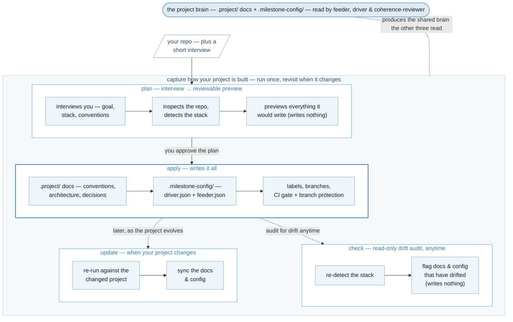

<p align="center">
  
</p>

The milestone-bootstrapper creates and stores all of the important parts of a project beyond the code. Conventions, style guides, production architecture, and framework decisions are captured here so the [`milestone-feeder`](https://github.com/kenmulford/milestone-feeder), [`milestone-driver`](https://github.com/kenmulford/milestone-driver), and [`milestone-coherence-reviewer`](https://github.com/kenmulford/milestone-coherence-reviewer) operate with that knowledge. The goal of this plugin is to reduce drift during longer code sessions by reinforcing *how* you architect your project.

It keeps all of that in two folders in your repo. The docs live under `.project/`, a file each. The `driver.json` and `feeder.json` that `milestone-driver` and `milestone-feeder` read live under `.milestone-config/`.

It also makes the repo ready for `milestone-driver` to build in. It provisions the labels both tools use, creates your integration and protected branches, writes a CI workflow that gates pull requests, and locks the protected branch behind that check.

It's a Claude Code plugin with four commands. `plan` interviews you and previews what it would write. `apply` writes it all. `update` syncs it when your project changes later. `check` is a read-only audit that flags when the docs or config have drifted from what the repo now looks like — it writes nothing.

**Install it.** First install the `superpowers` plugin — milestone-bootstrapper needs it at runtime, and you add it yourself (earlier releases installed it for you; now it's a manual step, so skipping it means the commands won't run). Add the official `claude-plugins-official` marketplace and install `superpowers` from it:

```
/plugin marketplace add anthropics/claude-plugins-official
/plugin install superpowers@claude-plugins-official
```

Then install milestone-bootstrapper itself, using one of the two methods below. Restart Claude Code afterward so the plugins load.

Recommended — install from the [`milestone-suite`](https://github.com/kenmulford/milestone-suite) marketplace, which catalogs all five suite plugins (`milestone-bootstrapper`, `milestone-designer`, `milestone-feeder`, `milestone-driver`, `milestone-coherence-reviewer`). Add one marketplace and install any of them:

```
/plugin marketplace add kenmulford/milestone-suite
/plugin install milestone-bootstrapper@milestone-suite
```

Or install just this plugin from its own marketplace — still supported:

```
/plugin marketplace add kenmulford/milestone-bootstrapper
/plugin install milestone-bootstrapper@milestone-bootstrapper
```



## Quick start

Four commands — `plan`, then `apply`, `update` when your project changes, and `check` to audit for drift anytime. Run them from inside the repo you're setting up.

1. **`plan` the project.**

   ```
   /milestone-bootstrapper:plan
   ```

   It interviews you about the project, detects your stack, looks at the repo, and writes a plan file you can read — every doc it would write and every config, label, branch, and CI change it would make. Nothing is written to the repo or to GitHub yet.

2. **Read the plan.** Open the plan file it points you to. Anything it couldn't answer it leaves marked `[TBD]` and flags for you — it doesn't guess. Change your answers and re-run `plan` if something's off.

3. **`apply` it.**

   ```
   /milestone-bootstrapper:apply
   ```

   It writes your answers into the `.project/` docs, then sets the repo up — configs, labels, branches, CI, and branch protection — in the right order, since protection can't require a CI check until the CI workflow exists.

4. **`update` when the project changes.** Switched the ORM, added Redis, moved the layering? Re-run `plan`, then:

   ```
   /milestone-bootstrapper:update
   ```

   It shows you the diff first, patches the config that drifted, proposes — never overwrites — edits to docs you've changed by hand, and flags — never deletes — anything in the repo your plan no longer mentions. If nothing changed, it does nothing and says so.

5. **`check` for drift, anytime.** A read-only audit — no interview, no writes:

   ```
   /milestone-bootstrapper:check
   ```

   It re-detects your stack and flags where it has drifted from what the docs and config record — the `.project/` docs against the repo, and `driver.json`'s `domainSkills` against the detected stack. It only reports; run `update` when you want to reconcile. The underlying scripts also run in CI (`--check` / `-Check`) to gate on drift.

The first time you run `plan` in a repo with no config, it writes a small profile for you and carries on — you don't re-run anything.

## Before you start

A few things need to be in place for `apply` and `update` to do their work. Each comes with what breaks without it.

- **`gh` (the GitHub CLI) installed and signed in**, in a directory connected to a GitHub repo — otherwise we can't create your branches, labels, CI, or protection.
- **`gh` with admin on the repo** — branch protection goes through the GitHub API and needs it. Without admin everything else still runs, and we flag the protection step rather than fail quietly. The floor it sets requires a pull request and passing CI, but zero human approvals — it's not a peer-review gate.
- **Claude allowed to run** `gh label create`, `gh api`, `gh repo edit`, and `git`, and to **write** under `.project/`, `.milestone-config/`, and `.github/workflows/`.
- **bash with `jq`, or PowerShell 7+** — every step ships both, so it runs on either.

`plan` and `check` need none of this. `plan` interviews, reads, and detects — what it writes is a local file you review; `check` only reads and reports. The writes above are for `apply` and `update`.

## Config

There's nothing to configure to start — the first `plan` run writes a small profile, and every setting has a default. The settings live in `.milestone-config/`, the same folder `milestone-driver` and `milestone-feeder` read. What `apply` writes there — your branch model, source paths, UI paths, the stack-specific skills the driver should cite, your versioning policy — is what those three consume, so you set it once and the suite runs on it.

## Status

**v0.7.0 — built.** `plan`, `apply`, `update`, and the read-only `check` drift audit all work, along with the interview, the `.project/` docs, and the suite-readiness steps. The bootstrapper was written up as a brief, planned with `milestone-feeder`, and built by `milestone-driver` — the suite built itself. For the full version history, see [CHANGELOG.md](CHANGELOG.md). Part of a dev-tools suite with `milestone-designer`, `milestone-feeder`, `milestone-driver`, and `milestone-coherence-reviewer`.

## Docs

- [SPEC.md](SPEC.md): the plan-file format — what `plan` writes and `apply` / `update` read.
- [docs/understanding-interview.md](docs/understanding-interview.md): how the interview captures and records each field.
- [BRIEF.md](BRIEF.md): the brief the suite built this from.

## License

[MIT](LICENSE).
